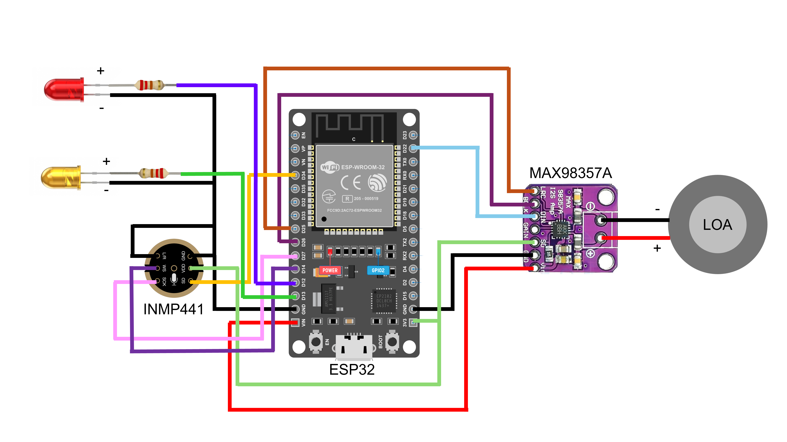

# Giám sát và điều khiển tích hợp ứng dụng các thiết bị điện trong nhà thông minh bằng giọng nói tiếng việt 🎙️💡

Đồ án tốt nghiệp ngành Kỹ thuật Điều khiển & Tự động hóa.
Hệ thống sử dụng **ESP32** để thu phát âm thanh và **Python Server** chạy mô hình **Whisper AI** (đã Fine-tune) để xử lý lệnh tiếng Việt tự nhiên.

## 🚀 Tính năng nổi bật
- [x] Nhận dạng giọng nói tiếng Việt chính xác với Whisper (OpenAI).
- [x] Phản hồi bằng giọng nói tự nhiên (Text-to-Speech).
- [x] Điều khiển thiết bị qua Home Assistant (Tuya, Yeelight).
- [x] Hoạt động cục bộ (Local), độ trễ thấp.

## 🛠️ Phần cứng sử dụng
- Vi điều khiển: **ESP32 DevKit V1**
- Microphone: **INMP441** (I2S)
- DAC/Amp: **MAX98357A** (I2S)
- Loa: 4 Ohm 3W

## ⚙️ Cài đặt

### 1. Phần cứng (Firmware)
Sử dụng **Arduino IDE** hoặc **PlatformIO**.
- Cài đặt thư viện: `WebSocketsClient`, `WiFi`.
- Nạp code trong thư mục `firmware/`.

### 2. Server (Python)
Yêu cầu: Python 3.10+, GPU (khuyến nghị).

```bash
cd server
pip install -r requirements.txt
python app.py
```

## 📸 Hình ảnh dự án

*(Chèn ảnh thực tế mô hình tại đây)*

## 👨‍💻 Tác giả
- **Hà Văn Linh** - MSSV: 105200414
- **Huỳnh Thái Bảo** - MSSV: 105200442